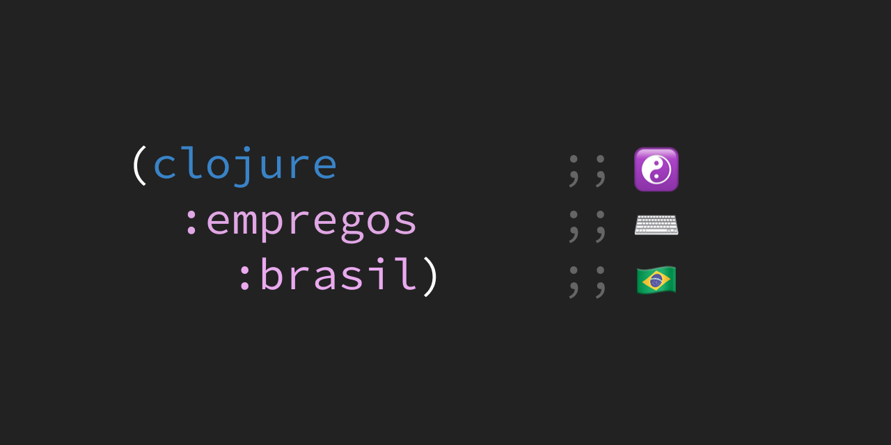

# Clojure Empregos Brasil

Vagas de empresas que ativamente contratam pessoas desenvolvedoras Clojure no Brasil. Quer anunciar uma vaga? Abra uma [issue](https://github.com/renatoalencar/clojure-empregos-brasil/issues).

## Vagas

|                                                               Vaga |      Empresa |                           Local | Remoto? |                                                                                                  Onde aplicar |
|--------------------------------------------------------------------|--------------|---------------------------------|---------|---------------------------------------------------------------------------------------------------------------|
|                                      Pessoa Engenheira de Software | 180° Seguros |                   São Paulo, BR |         |                                    https://180-seguros.breezy.hr/p/6227cb95c7c6-pessoa-engenheira-de-software |
| Pessoa Engenheira de Software (Vaga exclusiva para Pessoas Pretas) | 180° Seguros |                   São Paulo, BR |         | https://180-seguros.breezy.hr/p/5f578930f265-pessoa-engenheira-de-software-vaga-exclusiva-para-pessoas-pretas |
|                                               Full Stack Developer | Flow Finance |                                 |     Sim |            https://airtable.com/embed/shrG8DnjAdAOAZm9h/tble1ghQMefhblMVK/viwOzu3raZSmdxK7Z/recGtRyuHlvFhUV0v |
|                                      Application Security Engineer |       Nubank |                       São Paulo |     Não |                                                              https://boards.greenhouse.io/nubank/jobs/3870458 |
|                                          Business Security Manager |       Nubank |                       São Paulo |     Não |                                                              https://boards.greenhouse.io/nubank/jobs/3400816 |
|                       Cyber Security Incident Responder Specialist |       Nubank |                       São Paulo |     Não |                                                              https://boards.greenhouse.io/nubank/jobs/3940699 |
|                            Defensive Security Engineer (Blue team) |       Nubank |                       São Paulo |     Não |                                                              https://boards.greenhouse.io/nubank/jobs/3947838 |
|                                         Security Software Engineer |       Nubank |                       São Paulo |     Não |                                                              https://boards.greenhouse.io/nubank/jobs/3695044 |
|                                                  Software Engineer |       Nubank |                       São Paulo |     Não |                                                              https://boards.greenhouse.io/nubank/jobs/2569175 |
|                                      Systems Engineer (SRE/DevOps) |       Nubank |                       São Paulo |     Não |                                                              https://boards.greenhouse.io/nubank/jobs/3372800 |
|                                                       Tech Manager |       Nubank |                       São Paulo |     Não |                                                              https://boards.greenhouse.io/nubank/jobs/2989044 |
|              Engenheira de Software (Vaga exclusiva para mulheres) |   Pipo Saúde | %LABEL_POSITION_TYPE_WORLDWIDE% |         |               https://pipo-saude.breezy.hr/p/2508984cb6c6-engenheira-de-software-vaga-exclusiva-para-mulheres |
|                                                   Engineer Manager |   Pipo Saúde | %LABEL_POSITION_TYPE_WORLDWIDE% |         |                                                  https://pipo-saude.breezy.hr/p/1d37185d13f0-engineer-manager |
|                            Especialista em Segurança da Informação |   Pipo Saúde | %LABEL_POSITION_TYPE_WORLDWIDE% |         |                           https://pipo-saude.breezy.hr/p/21590ad632c4-especialista-em-seguranca-da-informacao |
|  Pessoa Engenheira de Software (Vaga exclusiva para pessoas trans) |   Pipo Saúde | %LABEL_POSITION_TYPE_WORLDWIDE% |         |   https://pipo-saude.breezy.hr/p/647061946892-pessoa-engenheira-de-software-vaga-exclusiva-para-pessoas-trans |
| Pessoa Engenheira de Software (vaga exclusiva para pessoas negras) |   Pipo Saúde | %LABEL_POSITION_TYPE_WORLDWIDE% |         |  https://pipo-saude.breezy.hr/p/1a9152c5e824-pessoa-engenheira-de-software-vaga-exclusiva-para-pessoas-negras |
|                                  Pessoa Engenheira de Software Jr. |   Pipo Saúde | %LABEL_POSITION_TYPE_WORLDWIDE% |         |                                  https://pipo-saude.breezy.hr/p/e2e72cd3c60e-pessoa-engenheira-de-software-jr |
|                                Pessoa Engenheira de Software Pleno |   Pipo Saúde | %LABEL_POSITION_TYPE_WORLDWIDE% |         |                               https://pipo-saude.breezy.hr/p/88be39a57a16-pessoa-engenheira-de-software-pleno |
|                               Pessoa Engenheira de Software Sênior |   Pipo Saúde | %LABEL_POSITION_TYPE_WORLDWIDE% |         |                              https://pipo-saude.breezy.hr/p/7f9fb45706e4-pessoa-engenheira-de-software-senior |
|                                                          Tech Lead |   Pipo Saúde | %LABEL_POSITION_TYPE_WORLDWIDE% |         |                                                         https://pipo-saude.breezy.hr/p/5cfe42cda790-tech-lead |

## Empresas que usam Clojure sem vagas no momento ou sem listagem pública

|           Empresa |                             Site |                     Onde aplicar |
|-------------------|----------------------------------|----------------------------------|
| Moleque de Ideias | https://www.molequedeideias.net/ | https://www.molequedeideias.net/ |
|            CSD BR |                https://csdbr.com |                     rh@csdbr.com |

## Empresas com vagas mas que usam Clojure eventualmente ou em projetos específicos

|      Empresa |                              Site |                            Onde aplicar |
|--------------|-----------------------------------|-----------------------------------------|
|          B2W | https://www.b2wmarketplace.com.br |                    https://b2w.gupy.io/ |
| Quinto Andar |   https://www.quintoandar.com.br/ | https://apply.workable.com/quintoandar/ |

## Licença

* [MIT](./LICENSE)
